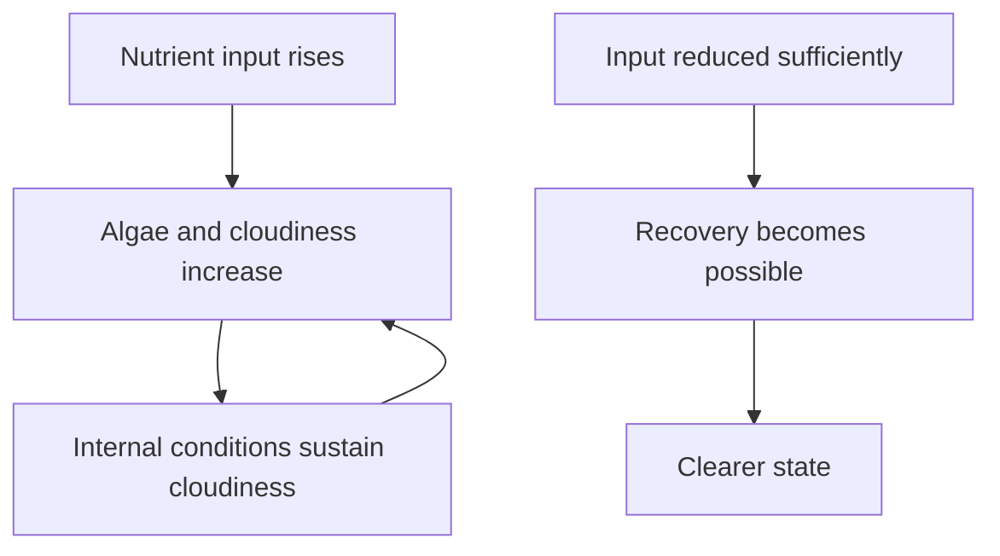

# Optional Week 1: Growing Loops and Tipping Points
*Optional Extension - Best for older learners or adult-led groups*

## Optional Module Plan and Supplied Case

**Status:** Optional depth, separate from the 18 core weeks and their checkpoint requirements. Choose by readiness and interest rather than age alone.

**Prior learning:** After Weeks 2 and 9: energy and population/feedback models.

**Time and materials:** About 20 minutes for the supplied paper case below, with paper and pencil; calculator optional. This is one practice activity, not the completion time for every guided session on the page. Use the existing session timings if teaching the full module. Read the case and response before the session.

**Supplied case — Feedback history:** Use the existing fictional pond model: it becomes cloudy above 8 input units, and returns clear only below 3. Begin clear. Inputs are 6, 9, 5, 2 in that order. Trace the state and explain the difference between a threshold and a reversible change.

**Illustrative response and reasoning:** States: clear, cloudy, cloudy, clear. At 5 the history matters: falling from 9 does not reverse the state yet. These invented thresholds illustrate hysteresis, not actual pond advice.

**Optional depth question:** Start cloudy at 6 and compare the result with starting clear at 6. Explain why a model needs a starting state as well as a current input.

**Facilitator check:** Look for a reason tied to the supplied evidence and one stated limit. Model that connection if it is missing; accept an oral, drawn, or written response rather than requiring exact wording.

**Open research prompts:** Any enrichment request to locate or construct missing external sources, real-case materials, media sets, tool activities, or interview records requires adult preparation, verification, and additional time. That request is an optional research suggestion, not supplied instruction. A tool activity with complete supplied steps remains instruction and may also need adult setup. The paper case can be completed without it, without a new account, real-world contact, or personal disclosure.

## This Week's Big Question

What happens when a loop makes a change grow instead of calming it down?

This optional week works best after Week 9. It gives older learners a clearer look at two different kinds of loops: loops that pull a system back toward balance and loops that make a change bigger.

## Kid Version in One Sentence

Some loops help systems settle down, and some loops make changes grow faster.

## You'll Discover

- how balancing loops and amplifying loops feel different
- why some systems reach a point where they start changing much faster
- how to talk about tipping behavior without turning it into a doom story

:::info Grown-up Note
- This week is optional. It is best for ages 10-12, highly interested younger learners, or adult-led groups.
- Keep the emotional tone steady. Focus on patterns, not fear.
- Sessions are designed for about 20 minutes. Use the Short Path when you only have 15-20 minutes. Extra Challenge options can stretch closer to 25-30 minutes.

**What Kids Should Not Walk Away Thinking**
- Not "everything is hopeless."
- Not "one loop explains everything."
- Not "humans are villains."
- Instead: large systems can contain both stabilizing loops and growing loops.
:::

## Week at a Glance

| | |
|---|---|
| Session length | About 20 minutes |
| Prep time | About 10 minutes |
| Materials | Paper, markers, Systems Log |
| Safety | If climate examples feel heavy, return to everyday loop examples |
| Core vocabulary | balancing loop, amplifying loop, tipping point, steady, runaway |
| Older learner words | positive feedback, negative feedback, hysteresis |

## Short Path for Younger Learners

- Compare one loop that settles down with one loop that grows.
- Draw both loops.
- Use only everyday examples, such as a thermostat and microphone squeal.

## Extra Challenge for Older Learners

- Add climate or ecosystem examples.
- Discuss why a system can behave differently after crossing a threshold.
- Compare reversible and hard-to-reverse changes.

## Read-Aloud Opening

"Some loops calm things down. Some loops make a change bigger. This week we are learning how to tell the difference, because that difference changes how a whole system behaves."

## Guided Session 1: Everyday Loops

**Time:** 20-25 minutes

**Materials:** paper, markers

**Activity steps:**

1. Draw one balancing loop, such as body temperature or a thermostat.
2. Draw one amplifying loop, such as microphone squeal or a rumor spreading.
3. Ask what each loop does to the starting change.

**Talk About It:**

- Which loop calms the system?
- Which loop makes the change bigger?
- Why would engineers want strong balancing loops?

## Guided Session 2: Tipping Behavior

**Time:** 20-25 minutes

**Materials:** paper, Systems Log

**Activity steps:**

1. Pick one system where change can speed up after a threshold.
2. Draw the before, threshold, and after pattern.
3. Keep the example age-appropriate and emotionally steady.

**Talk About It:**

- What changed before the threshold?
- What changed after it?
- Why is it useful to notice the pattern early?

## Systems Log

```text
What I noticed:
What moved:
Where it came from:
Where it went:
My drawing:
One question I still have:
```

## Systems Thinking Move

This optional extension is still about connected parts, not doom stories.

- What parts are in this system?
- What changes over time?
- What happens next?
- What feedback loop might make the change stronger or weaker?
- What should we check before making a dramatic claim?

## Environmental Data Check

- What do these lines, arrows, or examples measure?
- What pattern do I notice before and after the threshold?
- What might this model not show about a real climate or ecosystem system?
- Is another trusted source showing a similar pattern?

## Engineer Corner

Optional depth for older learners and facilitators. The main lesson can be completed without these terms or calculations.

### Feedback signs, delays, and hysteresis

**Explanation:** Amplifying feedback reinforces a change; balancing feedback opposes it. “Positive” and “negative” describe the direction of feedback, not good and bad. Delays can cause oscillation because a correction arrives after conditions change. Hysteresis means a system's current state depends on its history: the switch-back point can differ from the switch-on point.

**Worked example:** A fictional pond model switches to a cloudy state when nutrient input rises above 8 model units. Once cloudy, it returns to clear only below 3 units because its internal conditions have changed. At 5 units it could be clear or cloudy depending on history. These invented thresholds illustrate hysteresis; they are not pond-management rules.



**Check:** Why might reversing an input change not immediately reverse the state? **Answer:** Delays, internal feedback, or different transition thresholds can retain effects of the past. A single arrow diagram does not establish actual thresholds.
