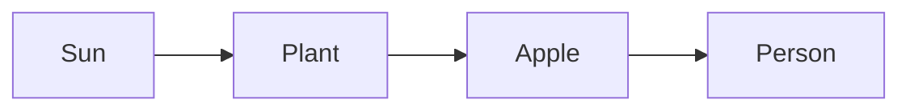

# Week 1: Sunlight Detective (How Solar Energy Drives Everything)
*Unit 1: The Planetary Engine*

## This Week's Big Question

How many things can you trace back to sunlight?

Sunlight can feel ordinary because it is always around. This week, children start treating it like a clue. Warm pavement, a sunny window, a breeze, an apple, and a moving cloud all point back to the same power source.

## Kid Version in One Sentence

The sun is the main power source for almost everything happening on Earth's surface.

## You'll Discover

- how sunlight can warm things you can touch and measure
- how arrows can show a path from the sun to plants, weather, and food
- why many Earth-surface systems stop working without sunlight

:::info Grown-up Note
- Main goal: help the learner notice sunlight as an input, meaning something that comes into a system from outside.
- Keep the mood curious, not grand. The child does not need a full lecture on photosynthesis or climate to succeed this week.
- Sessions are designed for about 20 minutes. Use the Short Path when you only have 15-20 minutes. Extra Challenge options can stretch closer to 25-30 minutes.

**Common Kid Misconceptions**
- Misconception: "The sun only gives light, not power." Response: "Light is one form of energy. When sunlight warms a cup or helps a plant grow, that is power in action."
- Misconception: "Food comes from the store, not the sun." Response: "Stores are one stop on the path. We can trace the food farther back."
- Misconception: "Everything on Earth uses solar energy." Response: "Almost everything on Earth's surface does. A few exceptions, like geothermal heat and tides, can go in the Older Learner box for now."
:::

## Week at a Glance

| | |
|---|---|
| Session length | About 20 minutes |
| Prep time | About 10 minutes |
| Materials | Two cups, water, sunny spot, dark paper or dark cup, light cup, pencil, paper, Systems Log |
| Safety | Do not use water near plugs or hot car interiors; avoid staring at the sun |
| Core vocabulary | sunlight, energy, input, arrow, photosynthesis |
| Older learner words | solar radiation, solar constant, throughput |

## Core Vocabulary

| Word | Kid-friendly meaning |
|---|---|
| sunlight | Energy from the sun that can light and warm things |
| energy | The power that makes things change, move, warm up, or grow |
| input | Something that comes into a system |
| arrow | A simple way to show where something goes next |
| photosynthesis | The way plants use sunlight to make sugar |

## Short Path for Younger Learners

- Do one cup test in sunlight.
- Draw three things the sun powered today.
- Make one arrow chain, such as `Sun -> plant -> apple -> me`.
- Use the Systems Log with a drawing and one spoken or written sentence.

Success looks like: the child can explain that sunlight powers many things even when the path is indirect.

## Extra Challenge for Older Learners

- Compare a dark cup and a light cup in the same sunlight and describe why one warmed faster.
- Trace two longer chains, such as `Sun -> warm ground -> moving air -> wind` and `Sun -> plant -> animal -> me`.
- Estimate how many everyday things in a room depend on sunlight somewhere in their story.

## Read-Aloud Opening

"Today we are becoming sunlight detectives. We are going to look at ordinary things and ask a new question: where did the power for that come from? A warm sidewalk, a leaf, an apple, a breeze, and even the food in your lunch can all lead us back to the sun."

## Guided Session 1: The Sunny Cup Test

**Time:** 20-25 minutes

**Materials:** two same-size cups, water, a sunny windowsill or outdoor spot, dark paper or a dark cup, a light or clear cup, notebook

**Safety note:** Do not place cups where they can spill onto electronics. Do not use a hot car as the test location.

**Setup:**

1. Fill both cups with the same amount of room-temperature water.
2. Make one cup dark and leave the other light.
3. Put both in the same sunny place.
4. Ask for a prediction before waiting.

**What to ask:**

- Which cup do you think will warm up faster?
- What is the sun doing to the water?
- If we left the cups longer, what might happen next?

**Activity steps:**

1. Let the child touch the cups at the start so they know they began the same.
2. Leave the cups in sunlight while you talk, draw, or do a quick second task.
3. Return and compare by touch.
4. Ask where the warming came from.

**Draw It:** Draw the two cups before and after. Add arrows from the sun to each cup.

**Talk About It:**

- Why might the dark cup soak up more sunlight?
- What else have you touched that felt warm from the sun?
- Where else do you think that kind of warming matters on Earth?

**What success looks like:** The child notices that sunlight can change the temperature of real objects.

## Guided Session 2: Follow the Arrows

**Time:** 20-25 minutes

**Materials:** paper, pencil or markers, Systems Log

**Setup:** Write or say one simple chain first: `Sun -> plant -> apple -> me`.

**Activity steps:**

1. Start with one familiar object, such as an apple, a sandwich, a houseplant, or a breeze outside.
2. Ask, "What happened right before this?" and keep going backward.
3. Draw arrow chains together.
4. Keep the younger path short: one object is enough.

Try examples like:

- `Sun -> plant -> apple -> me`
- `Sun -> warm ground -> moving air -> wind`
- `Sun -> plant -> cow -> milk`

**Talk About It:**

- Which arrow chain surprised you most?
- What would stop if sunlight stopped coming in?
- Is the sun powering only living things, or also weather and water movement?

**Draw It:** Draw three things the sun powered today.

**What success looks like:** The child can use arrows to trace at least one everyday thing back to sunlight.

## Outdoor And Fieldwork Safety

- stay with a trusted adult or group
- use a sunny window, schoolyard, porch, library window, or photo if outdoor access is limited
- do not stare at the sun
- keep water away from plugs and electronics
- observe without climbing, running into traffic, or handling unknown materials

When we study the environment, we observe carefully, stay safe, and respect living things.

## Systems Log

Use this simple entry:

```text
What I noticed:
What moved:
Where it came from:
Where it went:
My drawing:
One question I still have:
```

Helpful prompts for this week:

- What I noticed: "The dark cup felt..."
- What moved: "Heat moved into..."
- Where it came from: "The energy came from..."
- My drawing: arrows from the sun to three things

## Systems Thinking Move

An environmental system is made of connected parts. When one part changes, other parts may change too. Some changes are quick. Some changes take time.

- What parts are in this system?
- What moves through the system?
- What causes what?
- What happens next?

Example chain:



Learners can draw systems as arrows, loops, maps, flowcharts, or storyboards. The goal is not a perfect diagram. The goal is to show connections.

## Engineer Corner

Older learners and facilitators can go one step deeper here.

- At the top of Earth's atmosphere, the sun provides about 1,360 watts per square meter. This is often called the solar constant.
- The ground receives less because some sunlight reflects away or gets absorbed by the atmosphere.
- A useful systems idea for later: energy keeps moving through Earth. Older learners may hear this called throughput, meaning how much moves through a system over time.
- A few Earth systems do not trace mainly to sunlight, such as geothermal heat and tides. Those are interesting exceptions, not the main pattern.
