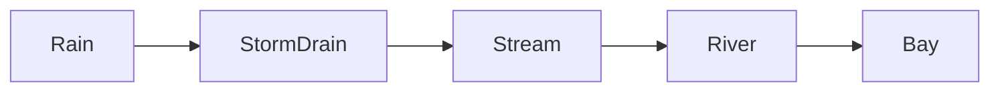

# Week 4: The Adventure of a Water Drop (How the Planet Moves Water)
*Unit 2: The Planet's Plumbing*

## This Week's Big Question

If one drop of water is in your cup today, where could it go next?

This week starts with a story about a single water drop. Children imagine it traveling up, down, underground, and back again until the water cycle feels like an adventure path instead of a vocabulary list.

## Kid Version in One Sentence

Water keeps moving from place to place in a loop, even when we cannot see every step.

## You'll Discover

- how a water drop can travel through five simple stops
- how water can hide in clouds, soil, and underground places
- why sink water and rainwater are part of bigger paths

:::info Grown-up Note
- Lead with the journey story before using formal cycle terms.
- Use the no-stove demo as the default for younger learners. Warm water in a bowl plus a clear cover is enough.
- Sessions are designed for about 20 minutes. Use the Short Path when you only have 15-20 minutes. Extra Challenge options can stretch closer to 25-30 minutes.

**Common Kid Misconceptions**
- Misconception: "Clouds are made of smoke or cottony air." Response: "Clouds are tiny water drops or ice crystals."
- Misconception: "Groundwater is a giant underground river everywhere." Response: "Sometimes it moves in cracks, but often it is water hiding in tiny spaces in soil and rock."
- Misconception: "Water disappears." Response: "It usually changed place or form."
:::

## Week at a Glance

| | |
|---|---|
| Session length | About 20 minutes |
| Prep time | About 10 minutes |
| Materials | Bowl or cup, warm water, clear plate or plastic wrap, ice if available, paper, pencil, Systems Log |
| Safety | Adult handles hot water if used; wipe spills quickly |
| Core vocabulary | water vapor, cloud, rain, storage place, groundwater |
| Older learner words | evaporation, condensation, precipitation, reservoir, aquifer |

## Core Vocabulary

| Word | Kid-friendly meaning |
|---|---|
| water vapor | Water in the air that we usually cannot see |
| cloud | Tiny water drops or ice floating in the sky |
| rain | Water falling back down from clouds |
| storage place | A place water can stay for a while |
| groundwater | Water hiding underground |

## Short Path for Younger Learners

- Do the bowl-and-cover water demo.
- Draw a five-stop water loop.
- Pretend to be one water drop and tell its journey aloud.
- Fill in the Systems Log with a drawing and one question.

Success looks like: the child can describe water moving through several places and coming back around.

## Extra Challenge for Older Learners

- Compare water stored in lakes, clouds, soil, and groundwater.
- Investigate where local sink water goes next.
- Notice that some storage places hold water for a short time and some hold it much longer.

## Read-Aloud Opening

"Imagine one tiny drop of water sitting in your cup. By next week it could be in the air, in a cloud, in a puddle, in the ground, or back in a river. This week we are following that drop wherever it goes."

## The Five-Stop Loop

`Ocean or lake -> water vapor -> cloud -> rain or snow -> river or ground -> ocean or lake`

## Guided Session 1: Make a Cloud on a Bowl

**Time:** 20-25 minutes

**Materials:** bowl, warm water, clear cover or plate, ice if available

**Safety note:** Use warm water, not boiling water, for the child-facing path.

**Setup:** Pour warm water into the bowl. Cover it with a clear plate, plastic wrap, or lid. Put ice on top if you have it.

**Activity steps:**

1. Look at the water in the bowl.
2. Wait and watch the inside of the cover.
3. Notice the water drops forming.
4. Tap the cover lightly and watch the drops fall.

**What to ask:**

- Where did the water on the cover come from?
- What changed between the bowl and the cover?
- How is this a tiny model of clouds and rain?

**Draw It:** Draw the bowl, the cover, the drops, and arrows showing where the water moved.

**Talk About It:**

- Where have you seen water drops form in real life?
- Why do you think water moves into the air?
- What would happen if the air cooled down again?

**What success looks like:** The child can connect the bowl demo to clouds and rain.

## Guided Session 2: Be the Water Drop

**Time:** 20-25 minutes

**Materials:** paper, markers, Systems Log

**Setup:** Draw five big circles or boxes on paper for the five water stops.

**Activity steps:**

1. Start with the water drop in one place, such as a cup, puddle, lake, or ocean.
2. Move it through the five-stop loop.
3. Add one side trip, such as groundwater, snow, or a plant.
4. Ask where local sink water might go after the drain.

**What to ask:**

- Which stop do you think a water drop visits most often?
- Where can water hide for a while?
- What path might sink water take after it leaves your house or school?

**Draw It:** Draw yourself as a water drop traveling through five places.

**Talk About It:**

- Which water places can you see easily, and which are hidden?
- Why is groundwater important even when we cannot see it?
- If all water moved too fast, what problems could that cause?

**What success looks like:** The child can tell a short water-drop story in the correct general order.

## Systems Log

Use this simple entry:

```text
What I noticed:
What moved:
Where it came from:
Where it went:
My drawing:
One question I still have:
```

Helpful prompts for this week:

- What I noticed: "Drops formed on..."
- What moved: "The water moved from... to ..."
- Where it went: "Next the drop could go to..."
- My drawing: a five-stop loop

## Outdoor And Fieldwork Safety

- stay with a trusted adult or group
- follow school, library, caregiver, or site rules
- do not drink untreated water
- do not touch storm drains, fast-moving water, or unknown waste
- use indoor bowl models, sink observations, maps, or photos when outdoor water study is not safe

When we study the environment, we observe carefully, stay safe, and respect living things.

## Systems Thinking Move

An environmental system is made of connected parts. Water moves through the system, and built paths such as storm drains can connect to natural paths such as streams and rivers.

- What parts are in this system?
- What moves through the system?
- What causes what?
- What might happen later?



## Environmental Data Check

This week can stay simple and still build data habits.

- What does this model or map show?
- Where was the water observed?
- What path can I see, and what part is hidden?
- What should I check before I make a bigger claim about local water?

## Engineer Corner

Older learners and facilitators can park the formal details here.

- Reservoir is the formal word for a storage place.
- Residence time means how long water tends to stay in one place.
- Aquifer is a groundwater storage zone in rock or sediment.
- Exact percentages for oceans, ice, groundwater, lakes, and the atmosphere belong here instead of the main path.
