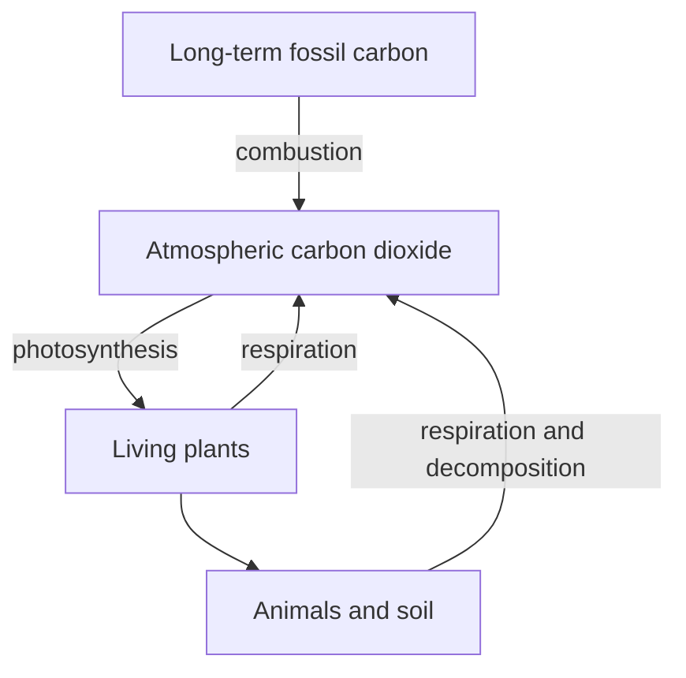

# Week 5: Carbon the Shape-Shifter (How Carbon Moves Through Living Systems)
*Unit 2: The Planet's Plumbing*

## This Week's Big Question

How can one tiny carbon atom travel through air, leaves, food, breath, and the ground?

Carbon shows up in familiar places: your body, a leaf, bread, wood, pencil graphite, and your breath. This week children follow carbon through fast living loops and slower underground storage paths.

## Kid Version in One Sentence

Carbon is a building block that keeps moving through living things, the air, and long-term storage places.

## You'll Discover

- where carbon shows up in everyday life
- how carbon can move in a fast loop through air, plants, food, and breath
- how some carbon stays underground for a very long time

:::info Grown-up Note
- Start with familiar carbon, not climate graphs.
- Keep the climate connection gentle and precise: the issue is not carbon itself, but how much old stored carbon is moved into the air and how fast.
- Sessions are designed for about 20 minutes. Use the Short Path when you only have 15-20 minutes. Extra Challenge options can stretch closer to 25-30 minutes.

**Common Kid Misconceptions**
- Misconception: "Carbon dioxide is bad and should not exist." Response: "Plants need carbon dioxide. The issue is amount and speed, not the existence of carbon."
- Misconception: "Breathing out is the same as burning fossil fuel." Response: "Breathing is part of a fast living loop. Fossil fuels move very old stored carbon into the air."
- Misconception: "All burning is exactly the same." Response: "Timescale matters. Recently grown material and fossil carbon are not on the same timeline."
:::

:::tip Coping Skill Moment
Learning about climate and the carbon cycle can stir up real worry. If it does, pause and ground yourself — feet on the floor, name three true things. Worry usually means you care. Once you feel steadier, you can think clearly about how the system works. (More on the [Coping Skills for Big System Problems](./coping-skills.md) page.)
:::


## Week at a Glance

| | |
|---|---|
| Session length | About 20 minutes |
| Prep time | About 10 minutes |
| Materials | Paper, markers, index cards or sticky notes, pencil, Systems Log |
| Safety | No special safety needs for the main path |
| Core vocabulary | carbon, breath, loop, storage, fuel |
| Older learner words | carbon cycle, carbon dioxide, fossil fuel, greenhouse effect, ppm |

## Core Vocabulary

| Word | Kid-friendly meaning |
|---|---|
| carbon | A building block found in living things and many materials |
| breath | Air moving in and out of a body |
| loop | A path that comes back around |
| storage | A place where something stays for a while |
| fuel | A material that can release stored energy |

## Short Path for Younger Learners

- Find five everyday things that contain carbon.
- Act out one carbon path: `air -> leaf -> apple -> person -> breath -> air`.


- Draw one fast carbon loop and one slow underground storage path.
- Add one Systems Log entry with a question.

Success looks like: the child can explain that carbon keeps changing places instead of staying in one object forever.

## Extra Challenge for Older Learners

- Compare fast carbon loops with slow underground storage.
- Discuss why moving stored fossil carbon into the air faster than return paths can cause system imbalance.
- Notice how timescale changes the meaning of the same atom moving through different paths.

## Read-Aloud Opening

"Today we are following a tiny carbon traveler. It might float in the air, get pulled into a leaf, become part of an apple, move into a person, and then go back into the air in a breath. Or it might stay underground for a very long time. Carbon is always on the move."

## Guided Session 1: Be a Carbon Atom

**Time:** 20-25 minutes

:::tip Problem Solving Moment
A big system becomes easier when you choose one loop: "This goes here, then this happens, then this changes." One loop gives you a place to start. (More on the [Problem Solving Skills](./problem-solving-skills.md) page.)
:::

**Materials:** index cards or sticky notes labeled air, leaf, apple, person, breath, soil

**Setup:** Place the cards around the room or table.

**Activity steps:**

1. Pick one child or token to be the carbon atom.
2. Move it from air to leaf.
3. Move it from leaf to apple.
4. Move it from apple to person.
5. Move it from person to breath and back to air.

**What to ask:**

- Did the carbon stop existing when it changed places?
- Which step depended on a plant?
- Which steps felt fast?

**Draw It:** Draw the fast carbon loop with arrows.

**Talk About It:**

- Which living things help move carbon around?
- Why do plants matter so much in this path?
- Where else could carbon go after the soil?

**What success looks like:** The child can trace one full carbon loop through living things.

## Guided Session 2: Fast Loop and Slow Storage

:::tip Communication Moment
The carbon cycle is easier to share when you explain one loop at a time: "Carbon goes here, then this happens, then it ends up there." Walking someone through a loop step by step turns a giant idea into something they can actually follow. (More on the [Communication Skills](./communication-skills.md) page.)
:::

**Time:** 20-25 minutes

**Materials:** paper, markers, Systems Log

**Setup:** Fold a paper into two sides: Fast Loop and Slow Storage.

**Activity steps:**

1. On one side, draw a quick living loop through air, plant, animal, and breath.
2. On the other side, draw carbon getting buried underground for a long time.
3. Add a path showing old stored carbon coming back out through fuel use.
4. Compare the speeds of the two paths.

**What to ask:**

- Which path moves quickly?
- Which path stores carbon for a long time?
- Why does speed matter when lots of old stored carbon moves into the air?

**Draw It:** Draw two carbon paths: a fast loop and a slow underground storage path.

**Talk About It:**

- Why is carbon useful for life?
- Why is the issue not just carbon, but timing and amount?
- What clues tell you a system is moving faster than its return path?

**What success looks like:** The child can compare a fast carbon loop with a slow storage path.

## Core Practice: How Carbon in Air Connects to Warming

**Time:** 15–20 minutes; use as the second half of Fast Loop and Slow Storage, or spread the week across another meeting. **Materials:** paper and two colors of arrows. **Goal:** connect fossil carbon entering the air with Earth's energy balance.

Sunlight brings energy to Earth. The surface warms and sends energy outward as **infrared radiation** — a kind of light our eyes cannot see. Greenhouse gases, including carbon dioxide, absorb and emit some infrared energy. The natural greenhouse effect helps keep Earth warm enough for life. Adding more carbon dioxide changes how energy escapes; Earth gains energy until warming increases outgoing energy toward a new balance. It does not create extra energy from nothing.

Burning fossil fuels moves carbon from long-term underground storage into the atmosphere as carbon dioxide. When additions exceed removals, atmospheric carbon dioxide builds up. **Carbon movement and heat movement are connected, but they are different things.** Carbon is matter; warming concerns energy. Current global warming is driven mainly by human increases in greenhouse gases, especially from fossil-fuel use.

1. Draw the Sun, Earth, atmosphere, and space. Use yellow arrows for incoming sunlight and red arrows for outgoing infrared energy. Show some infrared energy absorbed and emitted by greenhouse gases, including toward the surface and toward space.
2. On a separate carbon path, draw fossil fuel → burning → atmospheric carbon dioxide. Explain how faster additions than removals increase the amount in the air.
3. Tell the two-part story: **more stored carbon burned → more carbon dioxide in air → changed escape of infrared energy → warming**. Do not use the carbon arrow as if it were a heat arrow.
4. Sort claims: "Carbon is bad" (**incorrect: carbon is essential to life**); "More CO₂ can change Earth's energy balance" (**supported**); "One cold day disproves long-term global warming" (**incorrect: one local day's weather is not a global long-term average**).

**Check and answer guide:** "Does warming mean energy was created?" No, the balance of incoming and outgoing energy changed. "Does a tree immediately cancel any amount of burning?" No; uptake rates, storage, and time matter. **Simplify:** narrate with three picture cards: burning fuel, CO₂ in air, changed energy escape. **Stretch:** connect the carbon stock/flow calculation in Engineer Corner to this energy explanation without treating stock units as temperature units.

**Model limits:** the drawing is a mechanism sketch, not a temperature forecast. CO₂ is not a solid lid; energy still escapes. A sealed-jar temperature demonstration also changes airflow and does not isolate this atmospheric mechanism.

**Reference, checked 2026-10-01:** [NASA: Causes of climate change](https://science.nasa.gov/climate-change/causes/).

## Systems Log

Use this simple entry:

```text
What I noticed:
What moved:
Where it came from:
Where it went:
My drawing:
One question I still have:
```

Helpful prompts for this week:

- What I noticed: "Carbon showed up in..."
- What moved: "The carbon moved from... to ..."
- Where it came from: "The plant got carbon from..."
- My drawing: fast loop and slow storage

## Systems Thinking Move

Carbon moves through living systems, storage places, and return paths. Timing matters as much as direction.

- What parts are in this system?
- What moves through the system?
- Which path is fast, and which is slow?
- What happens if old stored carbon moves into the air faster than return paths can keep up?

## Environmental Data Check

:::tip Learning Moment
A big cycle is easier to learn one loop at a time. Try drawing the carbon loop from memory, then check what was missing. The missing arrow shows exactly what to practice next.
(More on the [Learning How to Learn](./learning-how-to-learn.md) page.)
:::


If you use a chart, climate graph, or source note this week, keep it guided and age-appropriate.

- What does this data measure?
- When was it collected?
- What pattern do I notice?
- What might this chart not show by itself?

Climate graphs, ppm values, and longer-timescale comparisons work best as guided support for ages 10-12 and optional extension for ages 11-13.

## Engineer Corner

Optional depth for older learners and facilitators. The main lesson can be completed without these terms or calculations.

### Carbon stocks and flow imbalance

**Explanation:** Carbon atoms move among air, organisms, soils, water, and longer-term stores. A stock is an amount held in a place; a flow is a transfer per unit time. Atmospheric carbon dioxide absorbs and emits infrared radiation, affecting how energy leaves Earth. Carbon cycling and energy flow are connected but describe different quantities.

**Worked example:** A fictional carbon store starts at 100 units. Add 8 units and remove 5 in one step: the new stock is 103. A return path can exist and still fail to keep pace with additions. Parts per million (ppm) express concentration; they are not the same as total carbon mass. The Keeling Curve records atmospheric CO₂, including a seasonal pattern and a longer-term rise.



**Check:** Does finding a carbon-removal path prove the atmospheric stock cannot rise? **Answer:** No; compare input and removal rates. Use [Source Notes](./source-notes.md) for measurements rather than treating this model as real data.
