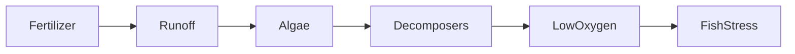

# Week 6: The Locked Food Plants Can't Open (The Nitrogen Cycle)
*Unit 2: The Planet's Plumbing*

## This Week's Big Question

If the air is full of nitrogen, why can't plants just use it right away?

This week uses a locked-lunchbox idea to make the nitrogen cycle concrete. The child learns that plants need help from bacteria to unlock a very important nutrient, and that too much unlocked plant food in water can overload a system.

## Kid Version in One Sentence

The air is full of nitrogen, but plants need bacteria to unlock it before they can use it.

## You'll Discover

- why nitrogen matters for living things
- how bacteria act like tiny keys in the nitrogen cycle
- why too much plant food washing into water can cause trouble

:::info Grown-up Note
- Keep the main analogy front and center: locked treasure, locked warehouse, or locked lunchbox.
- Use root nodules, plant roots, or simple pictures as the concrete anchor.
- Sessions are designed for about 20 minutes. Use the Short Path when you only have 15-20 minutes. Extra Challenge options can stretch closer to 25-30 minutes.

**Common Kid Misconceptions**
- Misconception: "Plants breathe nitrogen straight from the air the way we breathe oxygen." Response: "Most plants cannot use nitrogen gas directly. They need it unlocked first."
- Misconception: "More fertilizer is always better." Response: "Too much plant food can spill into water and overload the system."
- Misconception: "An algae bloom means the water is healthy because more plants are growing." Response: "Too much fast growth can lead to low oxygen later."
:::

## Week at a Glance

| | |
|---|---|
| Session length | About 20 minutes |
| Prep time | About 10 minutes |
| Materials | Paper, pencil, beans or tokens, plant root photo if available, jar of water pictures or drawings, Systems Log |
| Safety | Wash hands after handling soil or plant roots |
| Core vocabulary | nitrogen, bacteria, root, soil, algae bloom |
| Older learner words | nitrogen fixation, ammonia, nitrate, Haber-Bosch, eutrophication |

## Core Vocabulary

| Word | Kid-friendly meaning |
|---|---|
| nitrogen | An important building material for living things |
| bacteria | Tiny living things that can help change materials |
| root | The part of a plant that grows underground |
| soil | Ground where roots, water, and nutrients meet |
| algae bloom | Very fast growth of tiny water plants |

## Short Path for Younger Learners

- Use the locked treasure analogy.
- Draw the four-step nitrogen loop.
- Look at roots and imagine bacteria as keys.
- Do one quick discussion about too much plant food in water.

Success looks like: the child can explain that bacteria help unlock nitrogen for plants.

## Extra Challenge for Older Learners

- Compare the air path, soil path, and water path for nitrogen.
- Discuss how human-made fertilizer changes the speed and amount of unlocked nitrogen in the system.
- Explain why oxygen can drop after an algae bloom.

## Read-Aloud Opening

"The air above us is packed with nitrogen, but plants cannot just grab it the way you might grab a snack from the table. For plants, it is more like food locked inside a lunchbox. This week we are learning who has the key."

## The Four-Step Loop

`Air -> bacteria -> soil -> plants and animals -> soil or air`

## Guided Session 1: The Tiny Key Story

**Time:** 20-25 minutes

**Materials:** paper, tokens or beans, plant root photo if available

**Setup:** Draw a locked treasure chest labeled nitrogen in the air.

**Activity steps:**

1. Show the locked treasure in the air.
2. Introduce bacteria as the key-holders.
3. Move the treasure into the soil.
4. Move it into a plant and then an animal.
5. Return some of it to soil and air.

**What to ask:**

- Why can't the plant open the lock by itself?
- Who helps with the unlocking?
- Where does the nitrogen go after the plant uses it?

**Draw It:** Draw nitrogen as locked treasure and bacteria as the key.

**Talk About It:**

- Why do roots matter in this story?
- Why might tiny bacteria be so important even though we cannot see them?
- What could happen if plants could not get unlocked nitrogen?

**What success looks like:** The child can tell the nitrogen story using the key analogy.

## Guided Session 2: When Too Much Plant Food Reaches Water

**Time:** 20-25 minutes

**Materials:** paper, markers, simple pond drawing

**Setup:** Draw a pond with fish, tiny water plants, and a nearby field or lawn.

**Activity steps:**

1. Add extra plant food washing into the pond.
2. Draw tiny water plants growing fast.
3. Show those plants dying and decomposers getting busy.
4. Show oxygen dropping and fish struggling.

Use simple language:

> Too much plant food washes into water. Tiny water plants grow too fast. When they die, decomposers use up oxygen. Fish can struggle.

**What to ask:**

- Why is the first fast growth not the whole story?
- What changes after the algae die?
- Why do fish need us to look at the whole loop, not just one step?

**Draw It:** Draw a pond before and after too much plant food enters.

**Talk About It:**

- What part of the system changed first?
- What part changed later?
- Why is "more" not always "better" in a loop?

**What success looks like:** The child can explain the simple cause-and-effect chain in a bloom.

## Systems Log

Use this simple entry:

```text
What I noticed:
What moved:
Where it came from:
Where it went:
My drawing:
One question I still have:
```

Helpful prompts for this week:

- What I noticed: "The key in this story was..."
- What moved: "Nitrogen moved from... to ..."
- Where it went: "Too much plant food went into..."
- My drawing: locked treasure or the before-and-after pond

## Systems Thinking Move

This lesson works best when learners see the whole chain, not just one step.

- What parts are in this system?
- What moves through the system?
- What happens first?
- What happens later?



## Who Is Affected?

Environmental problems and benefits are not always shared equally. Some communities have easier access to clean water, shade, and protected streams. Some places face more runoff, flooding, heat, or water-quality stress.

- Who is affected if water quality gets worse?
- Who uses this water or lives nearby?
- What would make the solution fairer, safer, or easier to use?

Use fictional ponds, school grounds, parks, farms, gardens, or neighborhood examples when possible so learners do not need to share private family details.

## Engineer Corner

Older learners and facilitators can keep the chemistry here.

- Nitrogen gas is written as N2.
- Plants often use nitrogen after bacteria convert it into forms such as ammonia or nitrate.
- Haber-Bosch is the industrial process that unlocks nitrogen for fertilizer at large scale.
- Exact formulas, reaction conditions, and global energy-use estimates belong here, not in the main path.
