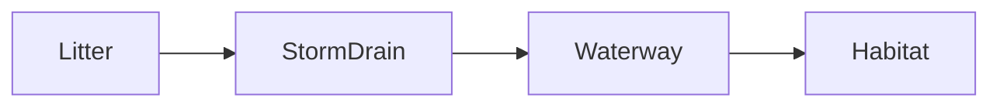

# Week 7: There Is No Away (Tracing a Product's Complete Physical Journey)
*Unit 2: The Planet's Plumbing*

## This Week's Big Question

When something goes in the trash, where does it actually go?

This week starts as a mystery. A bottle, cereal box, banana peel, or sheet of paper looks simple until children trace the full road map behind it. The object is not the villain. The path is the lesson.

## Kid Version in One Sentence

Throwing something away only moves it somewhere else.

## You'll Discover

- how one object can have a long physical journey
- why recycling, trash, and compost lead to different next places
- how to draw an object's path as a map with stops

:::info Grown-up Note
- Keep the tone curious and calm. The goal is tracing, not guilt.
- Choose clean, safe objects only. Do not inspect dirty trash.
- Sessions are designed for about 20 minutes. Use the Short Path when you only have 15-20 minutes. Extra Challenge options can stretch closer to 25-30 minutes.

**Common Kid Misconceptions**
- Misconception: "Away is a real place." Response: "Away usually means another place in the system."
- Misconception: "Recycling means the same item becomes the same item forever." Response: "Sometimes it can, but often the material changes into something else or leaves the loop later."
- Misconception: "The bottle is bad." Response: "The object is a clue. We are studying the path it travels."
:::

:::tip Coping Skill Moment
Tracking where waste really goes can feel discouraging — there's so much of it. Instead of *"I have to fix all of this,"* try: *"What is one useful action I can take or learn about today?"* One small change you actually do beats a giant change you only worry about. (More on the [Coping Skills for Big System Problems](./coping-skills.md) page.)
:::

:::tip Communication Moment
An "away audit" is really one question asked over and over: "Where does this actually go?" Asking clearly — of yourself, a label, or an adult — is how you trace a system. A good question turns a vague "away" into a real place you can see. (More on the [Communication Skills](./communication-skills.md) page.)
:::

## Week at a Glance

| | |
|---|---|
| Session length | About 20 minutes |
| Prep time | About 10 minutes |
| Materials | One clean object from home, school, library, classroom, or a shared sample set; paper; markers; Systems Log |
| Safety | Use clean items only; do not sort dirty trash or sharp metal |
| Core vocabulary | path, trash, recycle, compost, return path |
| Older learner words | lifecycle, linear system, PET, downcycling |

## Outdoor and Fieldwork Safety

- stay with a trusted adult or group
- use clean sample items only; do not handle dirty trash, broken glass, needles, chemicals, or sharp metal
- wash hands after touching packaging or shared sorting tools
- use photos, drawings, or teacher-provided sample sets when litter or waste handling would be unsafe
- offer indoor alternatives for learners who cannot safely go outside

When we study the environment, we observe carefully, stay safe, and respect living things.

## Core Vocabulary

| Word | Kid-friendly meaning |
|---|---|
| path | The route something takes |
| trash | A stream that usually goes to dumping or burning |
| recycle | To process material so it can be used again |
| compost | To let food or plant material break down into soil-like material |
| return path | A way for material to become useful again |

## Short Path for Younger Learners

- Pick one clean object.
- Draw its journey as a road map with 4-6 stops.
- Ask where it goes after use.
- Fill in the Systems Log with one drawing and one question.

Success looks like: the child can explain that an object has a before path and an after path.

## Extra Challenge for Older Learners

- Compare two different endings for the same object: recycling, landfill, compost, repair, or reuse.
- Notice which materials have an easier return path and which do not.
- Discuss why even recycling still needs energy, sorting, and working systems.

## Read-Aloud Opening

"Today we are solving an 'away' mystery. When something leaves our hands, it does not leave the planet. It goes to another place, changes form, or enters a new system. We are going to map that journey like detectives."

## Guided Session 1: Map One Object's Journey

**Time:** 20-25 minutes

**Materials:** one clean bottle, cereal box, old paper, cardboard box, or banana peel; paper; markers

**Safety note:** Choose clean, dry objects only.

**Setup:** Put the object in the center of the table.

**Activity steps:**

1. Ask where the object came from before it reached the house or classroom.
2. Add stops going backward: ground, field, tree, factory, truck, store.
3. Add the use step.
4. Add the possible next places after use.

Simple example:

`ground -> factory -> store -> use -> recycling or trash -> next place`

**What to ask:**

- What was this object before it was this object?
- Which stop in the journey took the most work?
- What happens after the object leaves us?

**Draw It:** Draw the object's journey as a road map with stops.

**Talk About It:**

- Which part of the path could you not see before today?
- Which endings are loops, and which are more like one-way paths?
- What would make this object's path easier to close into a loop?

**What success looks like:** The child can tell the object's story from source to next place.

## Guided Session 2: Sort the Next Place

**Time:** 20-25 minutes

**Materials:** 3-5 clean objects, paper labeled trash, recycling, compost, reuse

**Setup:** Make four labeled zones or signs.

**Activity steps:**

1. Put each clean object in the middle.
2. Ask where it should go next and why.
3. Talk about what happens after that step.
4. Notice which items have strong return paths and which are hard to loop.

**What to ask:**

- Which items have a clear next place?
- Which items are hard to loop back into use?
- Is the next place the end, or just another stop?

**Draw It:** Draw one object's path ending in two different ways.

**Talk About It:**

- What is the difference between reusing and recycling?
- Why does compost work for some materials and not others?
- What material seems easiest to loop well?

**What success looks like:** The child can compare at least two different endings for one object.

## Systems Log

Use this simple entry:

```text
What I noticed:
What moved:
Where it came from:
Where it went:
My drawing:
One question I still have:
```

Helpful prompts for this week:

- What I noticed: "This object was made from..."
- What moved: "The object moved from... to ..."
- Where it went: "After use it could go to..."
- My drawing: a road map with stops

## Systems Thinking Move

An environmental system is made of connected parts. When one part changes, other parts may change too. Some changes are quick. Some changes take time. Some effects are easy to see, and some are hidden.

Learner questions:

- What parts are in this system?
- What moves through the system?
- What causes what?
- What happens next?
- What might happen later?

Helpful model:



## Environmental Data Check

- What does this object map or sorting result show?
- Where did this information come from?
- What path can I see clearly, and what part is still hidden?
- What might this example not show about another place?
- What should I check before making a bigger claim about recycling, compost, or trash?

## Who Is Affected?

Environmental problems and benefits are not always shared equally. Some communities have easier access to recycling, composting, safe collection systems, or clean public spaces. Some do not. Learning about this should help us ask fair questions and look for realistic choices without blaming children or families.

- Who is affected when litter or waste leaks into shared places?
- Who benefits when a return path is easy to use?
- Does everyone have the same choices or services?
- What would make the system fairer, safer, or easier to use?

## Engineer Corner

Older learners and facilitators can keep the deeper supply-chain details here.

- PET chemistry, exact recycling rates, and downcycling complexity belong here.
- A useful systems insight: recycling helps, but a loop still has costs, losses, and limits.
- A return path is stronger when the material is clean, sorted, and easy to process.
