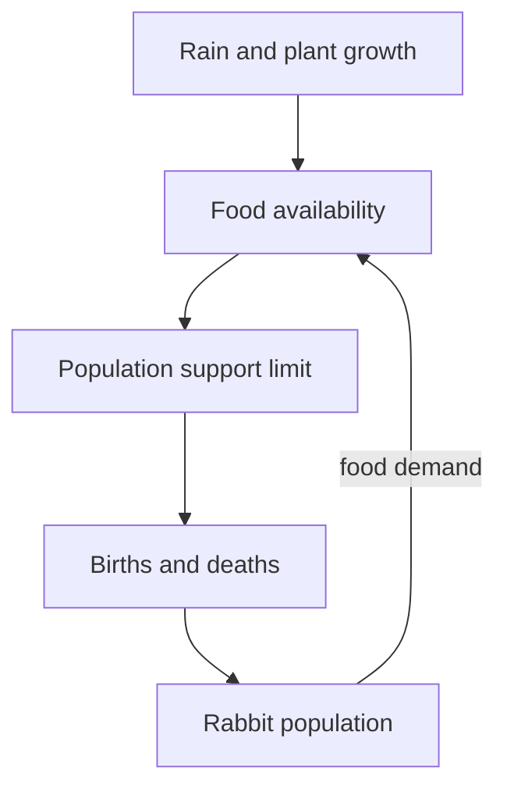

# Week 8: How Much Is Too Much? (How Much Load Can a System Handle?)
*Unit 3: Limits and Patterns*

## This Week's Big Question

How much can a system handle before it starts getting damaged?

Children already know the feeling of too much: too many kids on a bench, too many plants in a pot, too many fish in a small tank, or too many cookies taken before more are baked. This week turns that feeling into a systems idea.

## Kid Version in One Sentence

A system can handle only so much before it starts to get damaged.

## You'll Discover

- why every system has a limit
- how a healthy amount and an overloaded amount can look very different
- why growth without enough support can cause a crash later

:::info Grown-up Note
- Say limit before carrying capacity in the main path.
- Use familiar examples first, then animals or ecosystems.
- Sessions are designed for about 20 minutes. Use the Short Path when you only have 15-20 minutes. Extra Challenge options can stretch closer to 25-30 minutes.

**Common Kid Misconceptions**
- Misconception: "More living things is always better." Response: "Only if the system can support them."
- Misconception: "A crash comes out of nowhere." Response: "Usually the system was being pushed past its limit first."
- Misconception: "One more won't matter." Response: "Sometimes a system looks fine until it crosses a threshold."
:::

:::tip Coping Skill Moment
Thinking about limits — how much a system can handle — can make a problem feel huge. Big system problems can make your brain say, *"I have to fix everything."* Try asking instead: *"What is one useful action I can take or learn about today?"* (More on the [Coping Skills for Big System Problems](./coping-skills.md) page.)
:::

## Week at a Glance

| | |
|---|---|
| Session length | About 20 minutes |
| Prep time | About 10 minutes |
| Materials | Paper, counters or blocks, bowl or small area to represent a habitat, Systems Log |
| Safety | Keep the examples imaginary or model-based; do not crowd animals for a demonstration |
| Core vocabulary | limit, load, crowding, grow back, damage, biodiversity, habitat |
| Older learner words | carrying capacity, regeneration, logistic growth, limiting factor |

## Core Vocabulary

| Word | Kid-friendly meaning |
|---|---|
| limit | The most a system can handle safely |
| load | How much pressure or demand the system is carrying |
| crowding | Too many things in one place |
| grow back | To return over time after being used |
| damage | Harm that makes the system work worse |

**Additional core words:** Biodiversity means variety in living systems; habitat means the place and conditions that support an organism. The supplied habitat card model adds these ideas without requiring real wildlife observations.

## Short Path for Younger Learners

- Compare a healthy amount and too much using counters, drawings, or stories.
- Draw a pond with enough fish and then too many fish.
- Talk about one everyday system that can get overloaded.
- Make one Systems Log entry with a before-and-after drawing.

Success looks like: the child can explain that every system has a limit.

## Extra Challenge for Older Learners

- Compare what happens when a system stays near its limit versus far beyond it.
- Notice that a limit can be shaped by food, space, water, oxygen, or other bottlenecks.
- Discuss why some historical case-study numbers are debated and should be treated carefully.

## Read-Aloud Opening

"You already know what too much feels like. Too many people on a small bench makes it wobble. Too many plants in one pot makes them compete. Too many fish in a small pond can mean not enough food or oxygen. Today we are learning how to spot those limits in systems."

## Guided Session 1: Healthy Amount or Too Much?

**Time:** 20-25 minutes

**Materials:** counters, paper, bowl or outlined space

**Setup:** Use the bowl or drawn pond as the system. Add counters one at a time.

**Activity steps:**

1. Start with a small number of counters and call it a healthy load.
2. Add more and more.
3. Ask when it starts to feel crowded or unstable.
4. Talk about what resource might run short first.

**What to ask:**

- What changed as we added more?
- Which resource would run out first: space, food, or oxygen?
- What clues tell you the system is near its limit?

**Draw It:** Draw a bench, pot, tank, or pond with a healthy amount and with too much.

**Talk About It:**

- Does every system have the same limit?
- What can raise or lower a limit?
- Why is the limit part of the system, not a random rule?

**What success looks like:** The child can identify a reasonable limit in a model or story.

## Guided Session 2: The Pond Story

**Time:** 20-25 minutes

**Materials:** paper, markers, Systems Log

**Setup:** Draw a pond with fish, food, plants, and water.

**Activity steps:**

1. Draw a pond with a healthy number of fish.
2. Add more fish and talk through what changes.
3. Add one stress, such as less food or less oxygen.
4. Compare the healthy system to the overloaded one.

**What to ask:**

- What keeps the first pond working?
- What goes wrong in the crowded pond?
- Would the problem fix itself quickly, slowly, or not at all?

**Draw It:** Draw a pond with a healthy number of fish, then too many fish.

**Talk About It:**

- What could help the overloaded pond?
- What would happen if extra fish kept being added?
- How is this like other systems you know?

**What success looks like:** The child can explain why the second pond is under too much load.

## Core Practice: A Habitat Supports More Than One Kind of Life

**Time:** 20–25 minutes; use as a second version of The Pond Story. **Goal:** explain how habitat changes affect different organisms and their relationships. **Materials:** paper habitat cards and organism cards. All requirements below are simplified, invented classroom rules — not habitat-management advice or real population estimates.

**Biodiversity** means variety in living systems, including different species, differences within species, and different ecosystems. Counting species is one useful measure, not the whole meaning. A **habitat** is the place and conditions that support an organism. More individuals of just one species does not necessarily mean more biodiversity.

Set out four habitat cards: **flowers**, **leaf litter**, **pond**, and **connected shrubs**. Add one card for each fictional organism type:

| Organism card | Needs in this classroom model |
|---|---|
| Bee | Flowers |
| Beetle | Leaf litter |
| Frog | Pond AND leaf litter |
| Bird | Connected shrubs AND beetles as food |

1. With every habitat card present, check each need. All **4 organism types** are supported. Draw a food link from beetle to bird and habitat links to the organisms that need them.
2. Imagine paving over the leaf litter. Remove that card. Beetles lose habitat, frogs lose one requirement, and birds lose their modeled food even though shrubs remain. Only **bees** have all modeled needs: **1 type** supported. This is a dependency model, not a claim that real organisms vanish instantly.
3. Compare two repair plans: **Plan A:** add more flowers; **Plan B:** restore leaf litter while keeping the pond and connected shrubs. Which repairs more missing needs? **B supports all 4 types again in the model. A still supports only the bee type**, however many flowers or bees it adds.
4. Explain a limit: real organisms may use other food or habitat, and recovery takes time and depends on many conditions. Restoring one patch does not guarantee every population returns.
5. Make a proposal drawing with the habitat change, affected organisms, one indirect effect, and an observation that would help check improvement. An optional adult-led observation can count habitat features from a safe path; do not capture, feed, disturb wildlife, alter habitats, or use species counts as a competition.

**Check:** "Why did the bird card lose support when shrubs stayed?" Its food link was affected. "Do twenty bees necessarily mean more species than four different organism types?" No. **Simplify:** use two organism cards and picture needs. **Extend:** add an alternative food link and show how it changes the model's result. **Artifact:** before/after habitat map and a reasoned repair choice.

**Reference, checked 2026-10-01:** [National Park Service: What is biodiversity?](https://www.nps.gov/subjects/biodiversity/what-is-biodiversity.htm). The card rules and counts are teaching inventions.


## Optional Depth and Worked Response

**Supplied practice, about 15–20 minutes:** [Week 8's fictional scenario, illustrative response, and depth question](./worked-examples-and-optional-depth.md#week-8) are ready to use after this week's core teaching. Choose the depth question by readiness and interest; it is not a prerequisite or core assessment requirement.

**Open research prompts:** Enrichment suggestions that ask you to locate sources, investigate a real case, choose a tool, or contact someone **without supplying the teaching material** need adult preparation and verified materials. Such suggestions are optional, not a supplied packet. A tool activity with provided instructions remains supplied instruction, though adult setup may be needed. Use the linked fictional practice when outside preparation or access is unavailable.

## Systems Log

Use this simple entry:

```text
What I noticed:
What moved:
Where it came from:
Where it went:
My drawing:
One question I still have:
```

Helpful prompts for this week:

- What I noticed: "The system looked healthy when..."
- What moved: "The load increased when..."
- Where it went: "The system started to lose..."
- My drawing: healthy pond and overloaded pond

## Systems Thinking Move

An environmental system is made of connected parts. When one part changes, other parts may change too. Some changes are quick. Some changes take time. Some effects are easy to see, and some are hidden.

Learner questions:

- What parts are in this system?
- What moves through the system?
- What changes over time?
- What happens next?
- What part of the system could we change safely?

Simple examples:

- more shade -> cooler pavement -> safer play area
- too many fish -> less food -> more stress

## Environmental Data Check

- What does this model count or compare?
- What labels, units, or arrows help me read it?
- What pattern do I notice as the load changes?
- What might this model not show about a real place?
- What should I ask before using one example as proof for every system?

## Who Is Affected?

Environmental problems and benefits are not always shared equally. Some playgrounds, parks, or streets have more shade, safer sidewalks, cleaner water, or more space. Some communities face more heat, crowding, flooding, or pollution.

- Who is affected when a system is pushed past its limit?
- Who benefits when the system stays healthy?
- What would make the setting fairer, safer, or easier to use?

## Engineer Corner

Optional depth for older learners and facilitators. The main lesson can be completed without these terms or calculations.


### A changing carrying capacity

**Explanation:** Carrying capacity describes the population a setting can support over time under particular conditions. It changes with water, food, shelter, disease, and other limits. Logistic growth is a simplified model in which growth slows as population approaches a capacity, often written K. A limiting factor constrains growth even when another resource is plentiful; adding sunlight will not fix a lack of water.

**Worked example:** A fictional meadow supports roughly 40 rabbits during a wet season. In a drought, available food may support only 25. A population of 35 can then exceed the new capacity. Capacity is not a wall that instantly removes animals, so overshoot is possible.



**Check:** Is K a permanent species number? **Answer:** No; it depends on the setting and conditions. Compare this loop with the population graph above it; a curve is a model, not a promise.
