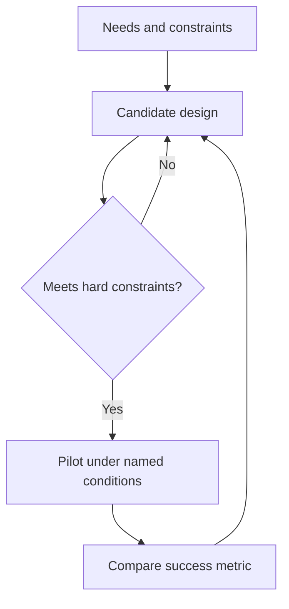

# Week 16: Make the Plan Real (What It Needs and What Gets in the Way)
*Unit 5: The Redesign Project*

## This Week's Big Question

What details make a plan ready to try in real life?

This week children add practical details to the redesign. They decide how often the loop would happen, who would help, what materials are needed, and how they would know whether the plan worked.

## Kid Version in One Sentence

Good plans get stronger when you add clear details about who does what, how often, and how success will be checked.

## You'll Discover

- how to turn a loose idea into a real plan card
- why every plan has limits and tradeoffs
- how to choose one low-pressure success check

:::info Grown-up Note
- Call it a Plan Card in the main path. The formal language can wait.
- Keep success metrics simple and reachable.
- Sessions are designed for about 20 minutes. Use the Short Path when you only have 15-20 minutes. Extra Challenge options can stretch closer to 25-30 minutes.

**Common Kid Misconceptions**
- Misconception: "If the idea is good, details do not matter." Response: "Details are what make an idea usable."
- Misconception: "A better loop should have no cost." Response: "Every better loop asks for something in return."
- Misconception: "Success means everything goes perfectly." Response: "Success can mean one measurable improvement."
:::

## Week at a Glance

| | |
|---|---|
| Session length | About 20 minutes |
| Prep time | About 10 minutes |
| Materials | Week 15 plan card, paper, markers, Systems Log |
| Safety | Keep plans practical and appropriate for the child's setting |
| Core vocabulary | plan card, amount, often, helper, success |
| Older learner words | specification, constraint, tradeoff, success metric, minimum viable loop |

## Core Vocabulary

| Word | Kid-friendly meaning |
|---|---|
| plan card | A short page that tells how the plan works |
| amount | How much |
| often | How frequently something happens |
| helper | A person with a job in the plan |
| success | A sign that the plan helped |

## Short Path for Younger Learners

- Fill in the kid-facing Plan Card.
- Add one drawing with labels for who, how often, and how much.
- Choose one low-pressure success check.
- End with one sentence about a tradeoff.

Success looks like: the child can show a concrete version of the plan instead of only talking about it.

## Extra Challenge for Older Learners

- Explain the smallest version that works.
- Compare two different success checks and choose one.
- Notice which plan details are required and which are optional improvements.

## Read-Aloud Opening

"Today we are making the plan real. Real plans answer questions like: how much, how often, who helps, what do we need, and how will we know it worked?"

## Kid-Facing Plan Card

```text
What will change?
How much?
How often?
Who does what?
What do we need?
What could be hard?
How will we know it worked?
```

## Guided Session 1: Fill the Plan Card

**Time:** 20-25 minutes

**Materials:** plan card, paper, pencil

**Setup:** Put the Week 15 plan beside a fresh Plan Card.

**Activity steps:**

1. Fill in each line with short, specific answers.
2. Replace vague words like "sometimes" with clearer ones like "twice a week" or "every lunch."
3. Add a helper if the plan cannot be done alone.
4. Notice what the plan still needs.

**What to ask:**

- How much of the material are you trying to change?
- How often would the new loop happen?
- Who would do each important part?

**Draw It:** Draw the redesign and label how much, how often, and who helps.

**Talk About It:**

- Which detail was hardest to decide?
- Which helper matters most?
- What detail makes the plan feel most real?

**What success looks like:** The child fills in all major parts of the Plan Card.

## Guided Session 2: Smallest Version That Works

:::tip Information Organization Moment
A proposal is only as strong as its organized evidence. Keep each claim next to its source and observation — a proposal row with an empty evidence box shows exactly what to collect next.
(More on the [Information Organization Skills](./information-organization.md) page.)
:::


**Time:** 20-25 minutes

**Materials:** plan card, markers, Systems Log

**Setup:** Ask the child to imagine the smallest version they could really try.

**Activity steps:**

1. Shrink the plan to a workable first version.
2. Name one tradeoff using this sentence: "We gain X but pay Y."
3. Choose one success check for one month or another short period.
4. Revise the drawing to match the smaller real version.

**What to ask:**

- What is the smallest version that still counts as your idea?
- What do you gain from the redesign?
- What time, space, money, or effort does it ask for?
- How will you know it helped?

**Draw It:** Draw the smallest version that works.

**Talk About It:**

- Why can a smaller first version be smarter?
- Which tradeoff feels acceptable?
- What success sign will be easiest to check honestly?

**What success looks like:** The child can explain one workable first version and one success check.


## Optional Depth and Worked Response

**Supplied practice, about 15–20 minutes:** [Week 16's fictional scenario, illustrative response, and depth question](./worked-examples-and-optional-depth.md#week-16) are ready to use after this week's core teaching. Choose the depth question by readiness and interest; it is not a prerequisite or core assessment requirement.

**Open research prompts:** Enrichment suggestions that ask you to locate sources, investigate a real case, choose a tool, or contact someone **without supplying the teaching material** need adult preparation and verified materials. Such suggestions are optional, not a supplied packet. A tool activity with provided instructions remains supplied instruction, though adult setup may be needed. Use the linked fictional practice when outside preparation or access is unavailable.

## Systems Log

Use this simple entry:

```text
What I noticed:
What moved:
Where it came from:
Where it went:
My drawing:
One question I still have:
```

Helpful prompts for this week:

- What I noticed: "My plan became more real when..."
- What moved: "The material would now move..."
- Where it went: "The return path would go to..."
- My drawing: labeled Plan Card

## Environmental Data Check

:::tip Executive Function Moment
A solution project needs visible roles and next steps. Before building, write who is doing what, and by when, so the work does not stall.
(More on the [Executive Function Skills](./executive-function.md) page.)
:::


- What does this success check actually measure?
- Who will collect the information?
- When will we check again?
- What labels, units, or counts will make the result easier to understand?
- What might this data not show about the whole system?

## Who Is Affected?

As the plan becomes more real, learners should ask:

- Who has to help this plan work?
- Who benefits if it works well?
- Who might find it confusing, costly, hard to access, or hard to use?
- What would make the plan fairer, safer, or easier to use?

## Project Integrity Check

Before moving on, make sure the plan is still honest and respectful.

- Keep facts, observations, data, opinions, feelings, and questions separate.
- Use evidence, examples, observations, data, or sources to support claims.
- Plan to give credit for outside facts, images, quotes, ideas, data, sources, or AI help.
- Make the final share readable and accessible for the audience.

## Engineer Corner

Optional depth for older learners and facilitators. The main lesson can be completed without these terms or calculations.

### Specifications and acceptance checks

**Explanation:** A specification names the required behavior. Hard constraints must be met, such as safe access or a budget limit. Soft preferences can be traded off, such as a favorite color. An operating parameter describes the test setting; a success metric describes the outcome to measure. A plan needs both so another person can try and judge it.

**Worked example:** A fictional paper-return station must fit a 40 cm shelf, cost no more than 10 pretend budget units, and allow everyone to reach it safely. Blue is a preference. A five-day pilot counts suitable sheets actually reused. “Collect 30 sheets” measures collection; “reuse at least 20 suitable sheets” measures the intended return function.



**Check:** Is a beautiful station that blocks a walkway successful? **Answer:** No; it fails a hard constraint before its reuse performance matters.
