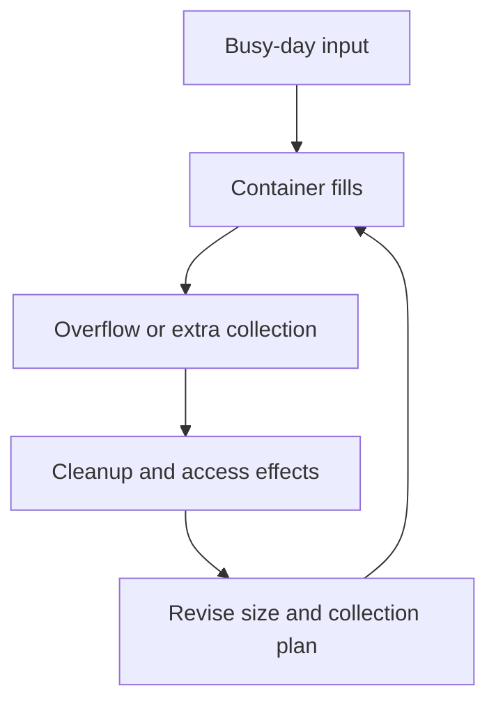

# Week 17: Test Your Plan Like a Friendly Troublemaker
*Unit 5: The Redesign Project*

## This Week's Big Question

What could go wrong with your plan, and how could you make it stronger?

This week teaches critique without meanness. Children start by naming one strength in the plan, then look for weak spots, surprise situations, and people who may be affected by the redesign.

## Kid Version in One Sentence

Strong plans get better when you test what could go wrong before you try them.

## You'll Discover

- how to find weak spots in a plan without attacking the person who made it
- how to name simple fixes or warnings
- how to notice who else might be affected by the redesign

:::info Grown-up Note
- Keep emotional safety explicit: critique the plan, not the person.
- Younger learners only need 2-3 possible problems, not a long list.
- Sessions are designed for about 20 minutes. Use the Short Path when you only have 15-20 minutes. Extra Challenge options can stretch closer to 25-30 minutes.

**Common Kid Misconceptions**
- Misconception: "If someone finds a problem, the plan is bad." Response: "Finding problems is how plans improve."
- Misconception: "Testing means trying to make a classmate fail." Response: "We are helping the plan, not hurting the person."
- Misconception: "One fix solves everything." Response: "Most plans still have tricky parts even after they improve."
:::

## Week at a Glance

| | |
|---|---|
| Session length | About 20 minutes |
| Prep time | About 10 minutes |
| Materials | Week 16 plan card, paper, pencil, Systems Log |
| Safety | Keep critique respectful and specific |
| Core vocabulary | problem, reason, fix, warning, person affected |
| Older learner words | failure mode, edge case, stakeholder, known limitation, second-order effect |

## Core Vocabulary

| Word | Kid-friendly meaning |
|---|---|
| problem | Something that could go wrong |
| reason | Why that problem might happen |
| fix | A change that could help |
| warning | Something people should know ahead of time |
| person affected | Someone the plan changes for |

## Short Path for Younger Learners

- Start with one plan strength.
- Find 2-3 possible problems.
- Fill in the simple problem table.
- End with one fix or warning for each problem.

Success looks like: the child can improve the plan by naming a few realistic weak spots.

## Extra Challenge for Older Learners

- Add surprise situations and second effects.
- Notice people who may like, dislike, or be burdened by the plan.
- Revise the plan card after the stress test.

## Read-Aloud Opening

"Today we are testing your plan like a friendly troublemaker. That means we are going to help the plan by looking for weak spots before they become real problems. We are not judging you. We are helping version 2.0 get smarter."

## Guided Session 1: Start With a Strength, Then Test It

**Time:** 20-25 minutes

**Materials:** plan card, paper, pencil

**Setup:** Write this sentence at the top of the page: `One thing that is strong about my plan is...`

**Activity steps:**

1. Name one strong feature.
2. Ask what could go wrong.
3. Ask why it might happen.
4. Add a fix or warning.

Use this simple table:

| Problem | Why it might happen | Fix or warning |
|---|---|---|
|  |  |  |
|  |  |  |
|  |  |  |

**What to ask:**

- What could go wrong?
- Why might that happen?
- What would make it easier?
- What is one thing you forgot before today?

**Draw It:** Draw the plan and add sticky-note style warnings to tricky spots.

**Talk About It:**

- Which problem seems most likely?
- Which one is easiest to fix?
- Which one might need a warning instead of a full redesign?

**What success looks like:** The child can name a few realistic problems and match them with fixes or warnings.

## Guided Session 2: Who Is Affected?

:::tip Collaboration Moment
Refining a proposal with others means disagreeing without attacking. Try: "My concern is ___ because our goal is ___." Concerns aimed at the proposal make it stronger; concerns aimed at people make the group weaker.
(More on the [Collaboration Skills](./collaboration-skills.md) page.)
:::


**Time:** 20-25 minutes

**Materials:** paper, markers, Systems Log

**Setup:** Write a short list of people the plan touches.

**Activity steps:**

1. Name the people affected.
2. Ask who might like the plan and who might find it annoying, costly, or confusing.
3. Revise one part of the plan to make it easier.
4. Add one known tricky part that is still not fully solved.

**What to ask:**

- Who has to help this plan work?
- Who might not like it?
- What would make it easier for them?
- What part is still tricky even after changes?

**Draw It:** Draw the plan with speech bubbles from two people affected by it.

**Talk About It:**

- Why is it useful to hear objections early?
- What is the difference between a plan flaw and a person flaw?
- How can version 2.0 improve without becoming too complicated?

**What success looks like:** The child can revise the plan after thinking about people affected and tricky parts.


## Optional Depth and Worked Response

**Supplied practice, about 15–20 minutes:** [Week 17's fictional scenario, illustrative response, and depth question](./worked-examples-and-optional-depth.md#week-17) are ready to use after this week's core teaching. Choose the depth question by readiness and interest; it is not a prerequisite or core assessment requirement.

**Open research prompts:** Enrichment suggestions that ask you to locate sources, investigate a real case, choose a tool, or contact someone **without supplying the teaching material** need adult preparation and verified materials. Such suggestions are optional, not a supplied packet. A tool activity with provided instructions remains supplied instruction, though adult setup may be needed. Use the linked fictional practice when outside preparation or access is unavailable.

## Systems Log

Use this simple entry:

```text
What I noticed:
What moved:
Where it came from:
Where it went:
My drawing:
One question I still have:
```

Helpful prompts for this week:

- What I noticed: "One weak spot in my plan was..."
- What moved: "The problem would happen when..."
- Where it went: "My fix would change the path by..."
- My drawing: plan plus warnings

## Environmental Checkpoint

:::tip Executive Function Moment
Refining can go forever without a done-enough check. Ask: what was the purpose, what parts matter most, and what can wait? Then build a clear Version 2 instead of chasing perfect.
(More on the [Executive Function Skills](./executive-function.md) page.)
:::


This week is a good time to pause before presenting.

- What claim am I making?
- What evidence, observations, data, or examples support it?
- What might be missing or left out?
- Who or what is affected?
- What tradeoff or unintended consequence still needs to be named?
- What should I check before I trust, share, repeat, or act on this idea?

## Ethical Communication Note

Strong projects do not need exaggeration, blame, shame, or fear. Learners can say:

- "I do not know yet."
- "This part still needs checking."
- "One limitation is ___."
- "One thing I would revise is ___."

## Engineer Corner

Optional depth for older learners and facilitators. The main lesson can be completed without these terms or calculations.

### Failure modes and second-order effects

**Explanation:** A failure mode is a way the plan could stop doing its job. An edge case is an unusual but plausible condition. A stakeholder is someone affected, including people doing the work. A second-order effect follows the immediate change, such as moving cleanup effort to another person. Stress testing is structured “what if” reasoning, not damaging the prototype.

**Worked example:** A fictional bottle-return station works on ordinary days but overflows on event day. Overflow is a failure mode; the larger crowd is a test condition. Adding a bigger bin might help, but it could make lifting unsafe. A safer revision could pair more frequent adult collection with a smaller container.



**Check:** Why ask who empties the bin before recommending a larger one? **Answer:** A change can shift work and risk to a stakeholder. Record the risk and mitigation, not just “works/doesn't work.”
